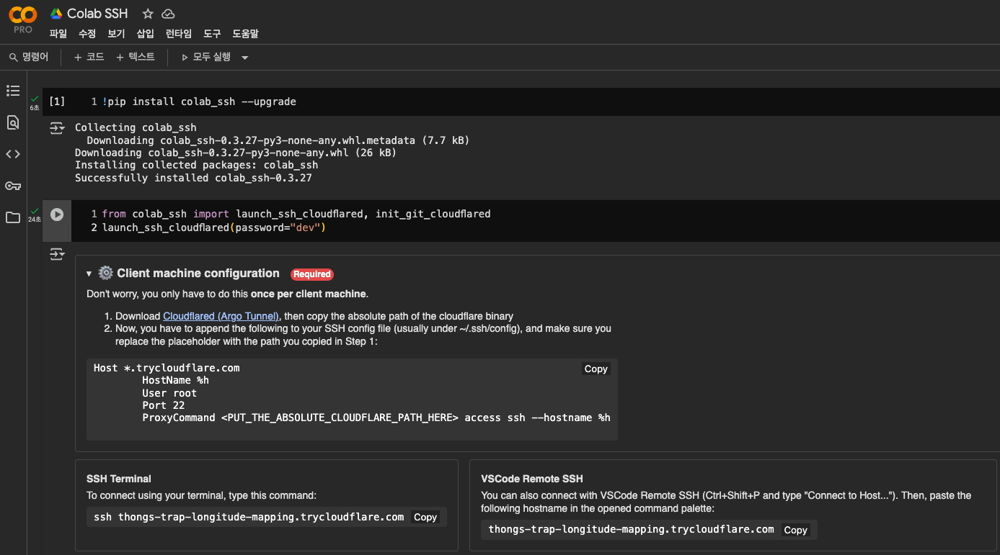

# In-Context Unlearning Unofficial Implementation

이 프로젝트는 Colab 환경에서 colab-ssh를 활용하여 VSCode로 개발되었습니다.

## Colab 환경 설정

Colab에서 다음 코드를 실행하여 환경을 준비하세요.

```python
!pip install colab_ssh --upgrade
from colab_ssh import launch_ssh_cloudflared, init_git_cloudflared
launch_ssh_cloudflared(password="")
```

위의 명령어만 실행하면 환경 준비가 완료됩니다.



## VSCode에서 원격 접속

VSCode에서 다음 코드를 Colab에 입력하여 SSH 비밀번호를 설정하세요.

```python
from colab_ssh import launch_ssh_cloudflared, init_git_cloudflared
launch_ssh_cloudflared(password="dev")
```

이후, VSCode의 Remote-SSH 확장 기능을 사용하여 제공된 호스트 정보로 접속하면 Colab 환경에서 직접 코드를 편집할 수 있습니다.

---
**실행 전 반드시 `pip install -r requirements.txt` 명령어를 실행해야 합니다.**

## 주요 스크립트 설명
- [`src/dataset.py`](dev/simple-in-context-unlearning/src/dataset.py):
  OpenAI API를 이용해 합성 의료 데이터셋을 생성하고, batch 결과를 CSV 파일로 변환합니다.

- [`src/finetune.py`](dev/simple-in-context-unlearning/src/finetune.py):  
  Unsloth efficient finetuning 라이브러리를 사용하여 주어진 데이터셋에 대해 모델을 파인튜닝합니다.

- [`src/unlearn.py`](dev/simple-in-context-unlearning/src/unlearn.py):  
  파인튜닝된 모델에 대해 In-Context Unlearning을 적용합니다. 평가를 수행하고 결과를 CSV 파일로 출력합니다.

---
## 프로젝트 실행
프로젝트는 `python main.py` 명령어와 다양한 인자를 통해 실행할 수 있습니다.

- `--type`: `paper`(논문 구현) 또는 `project`(커스텀 데이터셋) 중 선택할 수 있습니다.
- `--task`: `dataset`(커스텀 데이터셋 구축), `finetune`(파인튜닝 진행), `eval`(언러닝 평가) 중 선택할 수 있습니다.
- `--n_ctxt`: context의 개수를 의미합니다. 예를 들어 3이면 언러닝할 데이터 1개와 실제 데이터 2개가 프롬프트에 포함됩니다. 5라면 언러닝할 데이터 1개와 실제 데이터 4개가 포함됩니다.

---
## 참고 문헌 및 크레딧

```
@article{pawelczyk2023context,
  title={In-Context Unlearning: Language Models as Few Shot Unlearners},
  author={Pawelczyk, Martin and Neel, Seth and Lakkaraju, Himabindu},
  journal={arXiv:2310.07579},
  year={2023}
}